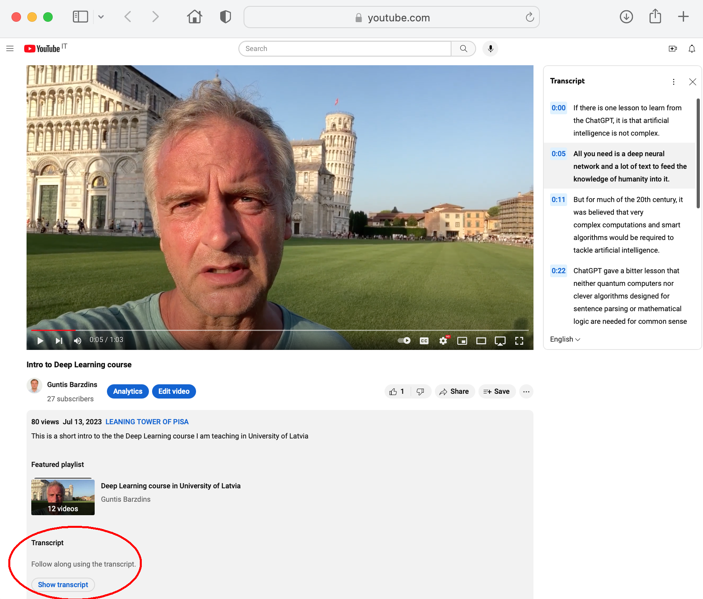

# DeepLearningCourse
Code for my Deep Learning Course at University of Latvia

## The course videos can be found here:
1. Intro to Deep Learning: https://youtu.be/2K2RMy-5ZsM (Book www.bishopbook.com/ )
2. Bigram Model: https://youtu.be/Kbc-8iEe6Js (Original: https://youtu.be/kCc8FmEb1nY ) 
3. Imitation learning (Data is King): https://youtu.be/8t4sxp7NVjg
4. Numerical Optimisation: https://youtu.be/u-Sn0f2XHnI
5. Architectures of Neural Networks: https://youtu.be/y6emEiI1lZw (Diffusion networks https://arxiv.org/abs/2402.04384 )
6. Intro to ChatGPT: https://youtu.be/HY-1RoVFftc (Course on [prompt engineering](https://github.com/microsoft/generative-ai-for-beginners ) ; GPT3 [explained](https://www.youtube.com/watch?v=0ZVOmBp29E0) )
7. Intro to Robotics: https://youtu.be/Bi9QtQb3vrA (Image segmentation example: https://github.com/paulispaulis/CLIC-semseg ; [KarpathyAtTesla](https://youtu.be/FnFksQo-yEY) )
8. From Bigram to ChatGPT: https://youtu.be/lZM36LLXWbc (Tokenization: https://youtu.be/zduSFxRajkE ; Attention: https://youtu.be/eMlx5fFNoYc ; What Transformers can learn: https://arxiv.org/abs/2310.16028)
9. What is Language? https://youtu.be/aJ-3botLBM0 (Diversity of modern languages implies they emerged AFTER HomoSapiens migration out of Africa https://youtu.be/rQv7NBGsldk ; [Impossible languages](https://arxiv.org/abs/2401.06416))
10. Compression by LLM: https://youtu.be/r-fSI7rSjYI (Original: https://youtu.be/zjkBMFhNj_g )
11. Evolutionary Learning: https://youtu.be/4OTuG0WRjaU (Demo https://youtu.be/GOFws_hhZs8 )
12. Neural Network Basics: https://youtu.be/5KNE_zvnNeA
13. Neural Network training (Backpropagation): https://youtu.be/GSZnx7VK3Zg (DetailedExplanation: https://youtu.be/VMj-3S1tku0 )
14. PyTorch library: https://youtu.be/NlzC9zTXTHM
16. Innovation: https://youtu.be/1Vhh_dYOu0I (Mystery2: Agentive evolutionary learning needs no training data)
17. Technological Evolution https://youtu.be/wIJnvCqKPXM (Mystery1: Incremental 1-shot memory for continuous learning)
18. Egocentric Viewpoint https://youtu.be/t3-InC9VEko (Mystery3: Concept creation)
<!-- 
16. PromptEngineering (using LLMs):
17. HuggingFace (using DNNs):
-->

### Transcripts for all videos available from YouTube
In video description (press "...more" to reveal it all), at the lower-left corner there is a button "Show transcrpt". 
Copy/paste transcript to your favourite editor (remove timestamps with "Toggle timestamps" under symbol ⋮ in the top-right corner).
<!-- The transcript will appear in the top-right section. The three dots in the top-right corner "Toggle timestamps" - you may want to remove timestamps before copy/paste them to your favorite text editor. Transcript languages are switched with the drop-down list below the transcript. -->

### How these videos were voiced and transcribed?

Videos were subtitled and voiced using SELMA UC0 OpenSource software available at: https://github.com/SELMA-project/UC0-OpenSource

